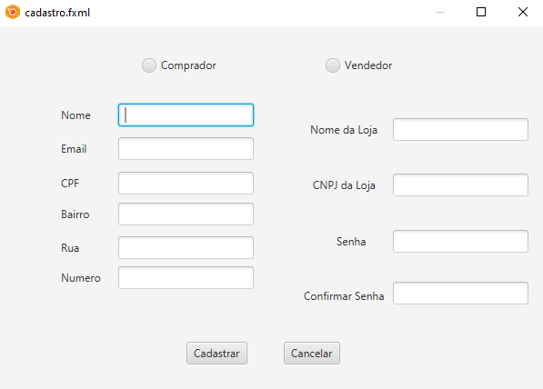
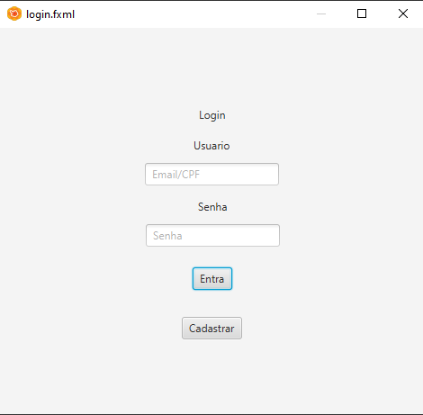
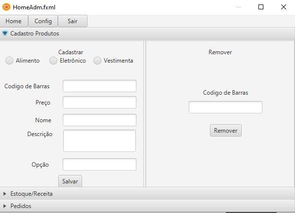
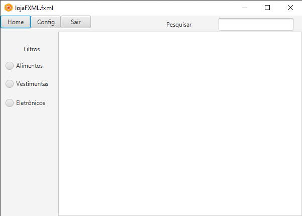

## Repositorio destinado a disciplina de Padrões de Projeto
#### Contém: 
* Atividades realizadas;

* Projeto da Disciplina: Uso de 5 padrões de projetos para simular um MVC(Sistema de Compra e Venda simplificado).

#### Algumas telas do projeto:

1. 

2. 

3. 

4. 

